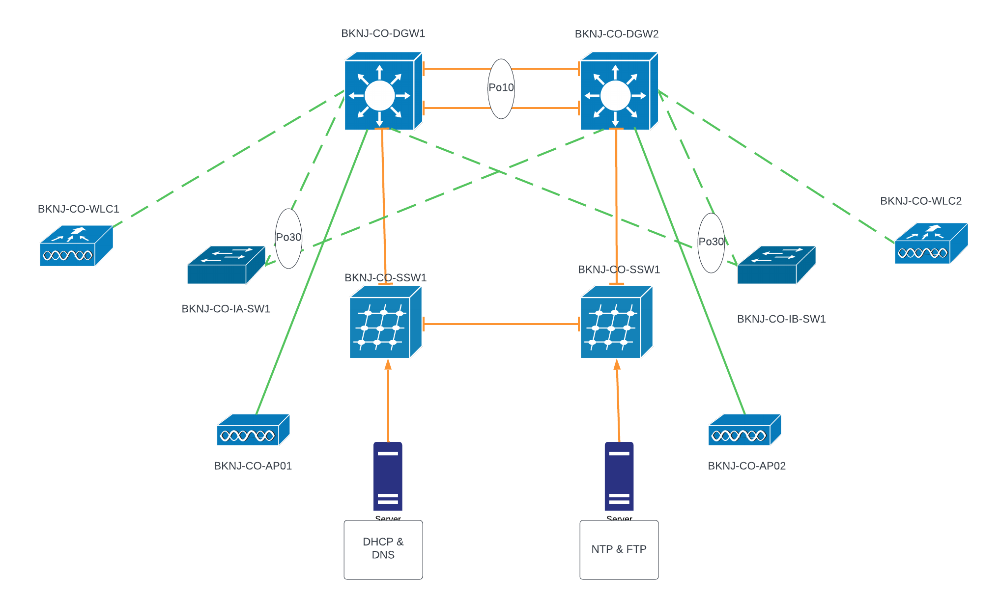

# Cisco_Cert for doing Cisco certifications

has 2 branches main and staging

The Lab topologies are structured to cater to particular certification exam rather pushes you to go beyond. This Lab practice is geared towards making you proficient in the Juniper world of devices as much as possible.

If you wish to recreate this setup please feel free fork the repo.

Cisco Lab setup:

Corporate Office:

Cisco Lab environment setup using Packet tracer:

Just install the latest version of Cisco Packet tracer from Cisco

Cisco Lab environment setup using GNS3

